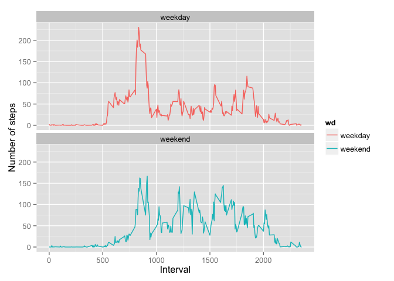

# Reproducible Research: Peer Assessment 1


## Loading and preprocessing the data

```r
## Reading data
unzip("activity.zip")
act <- read.csv("activity.csv")
file.remove("activity.csv")
```

[1] TRUE

```r
## Calculating number of steps per date
daysteps <- aggregate(steps ~ date, data=act, sum)
## Calculating number of steps per interval
timesteps <- aggregate(steps ~ interval, data=act, mean)
```

## What is mean total number of steps taken per day?
Histogram of the total number of steps taken each day


```r
hist(daysteps$steps, main="Histogram of number of steps", xlab="Number of steps")
```

 

Mean and median number of steps taken each day


```r
mean(daysteps$steps)
```

[1] 10766.19

```r
median(daysteps$steps)
```

[1] 10765

## What is the average daily activity pattern?
Time series plot of the average number of steps taken (averaged across all days) versus the 5-minute intervals


```r
plot(timesteps$interval, timesteps$steps, type = "l", 
     xlab="5-minute interval", ylab="Average number of steps taken")
```

 

5-minute interval that, on average, contains the maximum number of steps:


```r
timesteps[timesteps$steps == max(timesteps$steps),]$interval
```

[1] 835

## Imputing missing values
Strategy for imputing missing data - replace missing values with an average number of steps taken (averaged across all days) during the specific 5-minute interval.  
Code for realizing the strategy.


```r
sum(is.na(act$steps))
```

[1] 2304

```r
actall <- act
i <- 0
while (i <= 2355) {
  actall[is.na(actall$steps) & actall$interval==i,]$steps <- 
    timesteps[timesteps$interval == i,]$steps
  i <- i + 5
}
daystepsall <- aggregate(steps ~ date, data=actall, sum)
```

Histogram of the total number of steps taken each day (without missing values)


```r
hist(daystepsall$steps, main="Histogram of number of steps (without missing values", xlab="Number of steps")
```

 

Mean and median number of steps taken each day (without missing values)


```r
mean(daystepsall$steps)
```

[1] 10766.19

```r
median(daystepsall$steps)
```

[1] 10766.19

## Are there differences in activity patterns between weekdays and weekends?


```r
actall$wd <- "unknown"
actall[weekdays(as.Date(actall$date)) %in% c("Saturday", "Sunday"),]$wd <- 
  "weekend"
actall[actall$wd=="unknown",]$wd <- 
  "weekday"
actall$wd <- as.factor(actall$wd)
library("ggplot2")
timestepsall <- aggregate(x=actall$steps, by = list(actall$interval, actall$wd), 
                       FUN="mean")
names(timestepsall) <- c("interval", "wd", "steps")
g <- ggplot(timestepsall, aes(x=interval,  y=steps, wd))
g+geom_line(aes(colour=wd))  + facet_wrap(~ wd, ncol=1) + ylab("Number of steps") + xlab("Interval")
```

 
